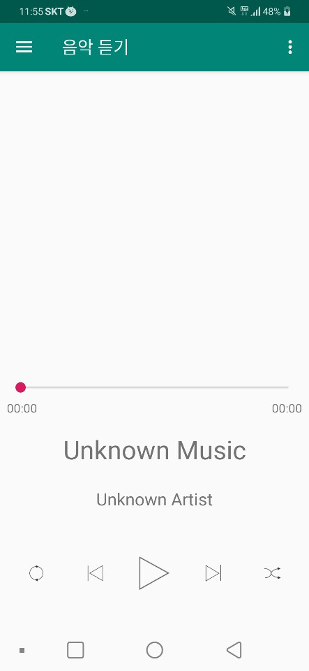
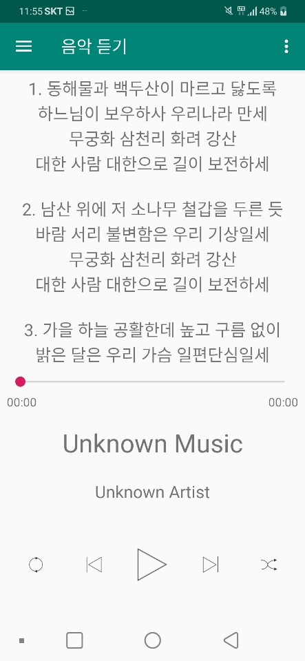
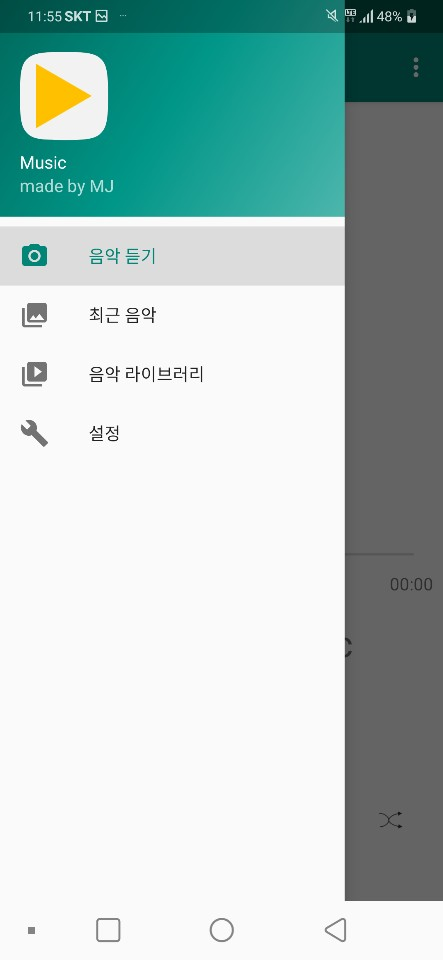
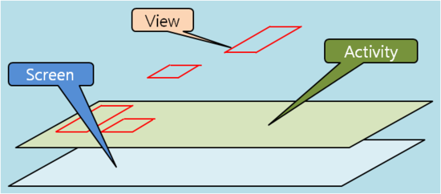
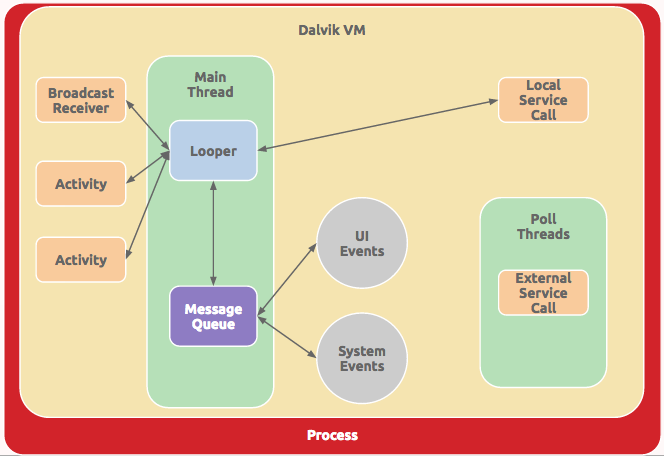

# hw_3 - MP3 Player    

## 테스트 환경  
유형 : Pixel 2 API 29  
타겟 안드로이드 버전 : 7.0  
안드로이드 스튜디오 버전 : 3.5  
테스트 PC OS : Windows10 x64  
테스트 PC 프로세서 : Intel i5-8265U  
테스트 PC RAM : 8GB  
사용 된 메모리 : 1232Mb 미만  
사용 된 CPU : 15 % 미만

## 개발
개발 언어 : JAVA

# UI 구현
## 음악듣기 

## 음악듣기 - 가사 화면
  
## 네비게이션  화면
  
## 최근 음악 화면
  
## 음악 라이브러리 화면
  
## 설정 화면
   

# 코드 구현

## 안드로이드 기본 구조

  
  

화면 전환을 Activity의 전환으로 하지 않는다.   
모든 화면의 전환은 fragment의 전환으로 구성했다.   

## Date Binding   
어플리케이션에서 화면에 있는 UI요소와 데이터를 연결시키는 것으로 코드 분리를 통한 최적화의 방법이다.  

## AAC(Andorid Architecture Component) - viewModel   
UI 관련 데이터를 보관하고, 관리하기 위해 디자인되었다.   
화면 전환과 같이 설정이 변경되는 상황에서도 data가 계속 남아있을 수 있도록 해준다.   

각 Fragment간 데이터 전달 시에 추가적인 작업을 할 필요가 없다.   
각 Fragment는 다른 Fragment의 라이프사이클을 신경쓰지 않고, 자신의 라이프사이클 대로 작업을 수행할 수 있다.   
그러므로 다른 Fragment가 사라지더라도 정상적으로 동작할 수 있다.   
 
 ## firebase   
 firebase에 음악 파일의 크기와 음악파일의 갯수를 입력해두어서   
 변화가 감지되지 않으면 mp3파일에서 데이터를 추출하지 않고 저장해 두었던 데이터를   
 그대로 사용한다.   
 또 현재 실행되고 있는 음악의 위치를 입력해두었다.